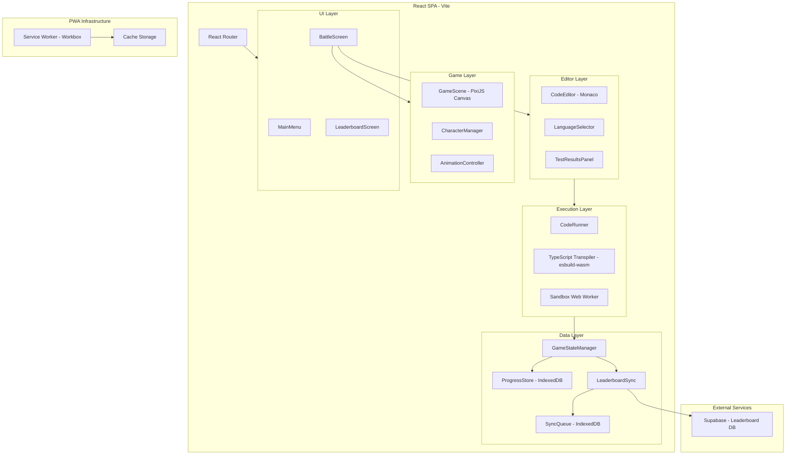
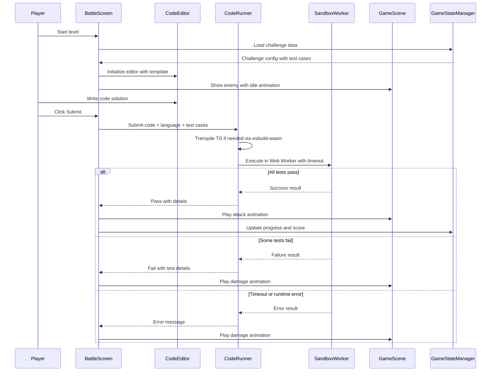
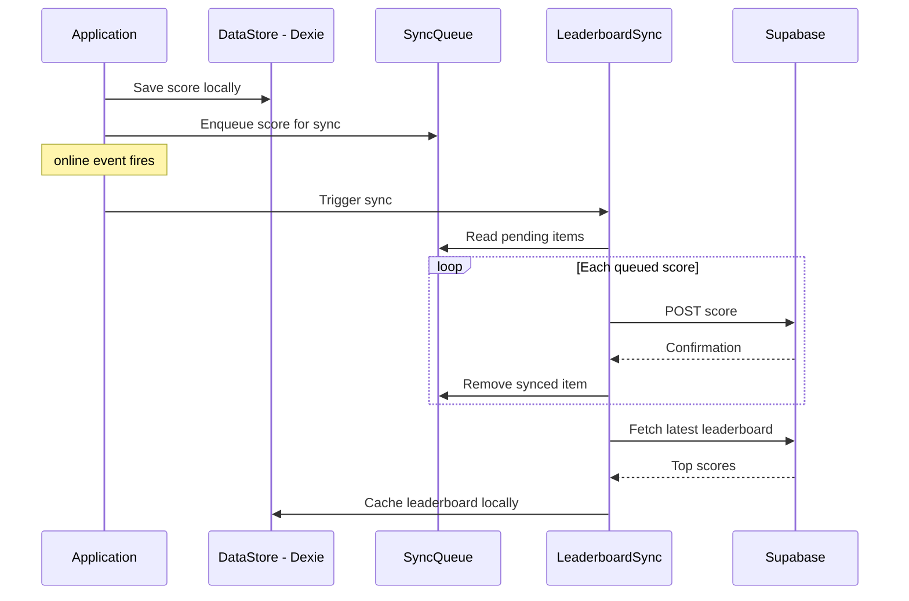
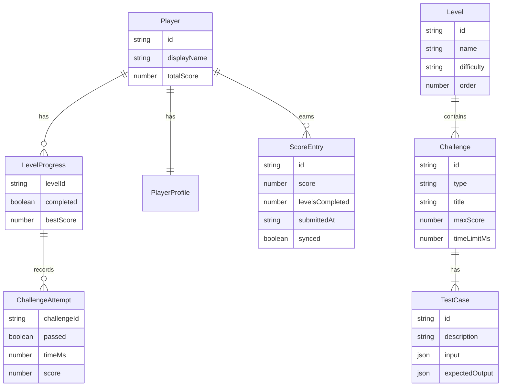

# Design Document

## Overview

**Purpose**: Coding Fighter delivers a browser-based coding game where players solve programming challenges to defeat enemies, providing an engaging way to practice JavaScript and TypeScript skills.

**Users**: Beginner-to-intermediate programmers who want to improve coding skills through gamified challenges with visual feedback.

**Impact**: Greenfield project creating a new React SPA deployed on Vercel with offline-first capabilities and a shared leaderboard.

### Goals
- Deliver a playable coding game with Monaco Editor integration and real-time visual feedback
- Support offline gameplay via PWA with iOS Safari compatibility
- Provide a shared leaderboard for competitive motivation
- Maintain 30+ FPS game animations alongside a heavyweight code editor

### Non-Goals
- Multiplayer real-time battles (future consideration)
- Server-side code execution or backend-rendered game logic
- Mobile-optimized touch controls (desktop-first, minimum 1024px)
- Custom 3D model creation or advanced 3D scenes
- Social features beyond leaderboard (chat, friends, etc.)

## Architecture

### Architecture Pattern & Boundary Map



**Architecture Integration**:
- **Selected pattern**: Component-based SPA with feature-based module organization. React manages routing, state, and UI; PixiJS manages game rendering on a separate canvas.
- **Domain boundaries**: Game rendering (PixiJS canvas), code editing (Monaco DOM), code execution (Web Worker thread), and data persistence (IndexedDB + Supabase) are fully isolated domains communicating through typed interfaces.
- **New components rationale**: Each layer addresses a distinct concern — no single library handles all of editor, sandbox, game rendering, and offline sync.

### Technology Stack

| Layer | Choice / Version | Role in Feature | Notes |
|-------|------------------|-----------------|-------|
| Frontend Framework | React 19.x | UI components, routing, state management | |
| Build Tool | Vite 6.x | Bundling, HMR, PWA plugin host | |
| Code Editor | @monaco-editor/react 4.7.0 + monaco-editor 0.55.1 | Embedded code editor with JS/TS support | Self-hosted for offline |
| Game Rendering | PixiJS 8.17.0 + @pixi/react 8.0.5 | 2D WebGL sprite animations | Separate canvas from DOM |
| UI Animations | Framer Motion 12.x | Menu transitions, health bars, result screens | |
| TS Transpilation | esbuild-wasm 0.27.x | Browser-side TypeScript to JavaScript | ~1.5 MB WASM |
| Local Storage | Dexie.js 4.x | IndexedDB wrapper for progress and sync queue | |
| Backend | Supabase (hosted) | Shared leaderboard, anonymous auth | Free tier: 500 MB, 50K MAU |
| PWA | vite-plugin-pwa 0.17+ with Workbox | Service Worker, precaching, manifest | injectManifest strategy |
| Routing | React Router 7.x | Client-side navigation | |
| State Management | Zustand 5.x | Lightweight global game state | |

> See `research.md` for detailed technology comparisons and rejected alternatives.

## System Flows

### Battle Flow



### Offline Sync Flow



## Requirements Traceability

| Requirement | Summary | Components | Interfaces | Flows |
|-------------|---------|------------|------------|-------|
| 1.1 | Embed Monaco Editor | CodeEditor | CodeEditorProps | — |
| 1.2 | JS/TS language support | CodeEditor, LanguageSelector | CodeEditorProps | — |
| 1.3 | Language-specific configuration | CodeEditor | CodeEditorProps | — |
| 1.4 | Default code template | CodeEditor, GameStateManager | ChallengeConfig | Battle Flow |
| 1.5 | Real-time syntax errors | CodeEditor | CodeEditorProps | — |
| 2.1 | Challenge presentation | BattleScreen, ChallengePanel | ChallengeConfig | Battle Flow |
| 2.2 | Execute against test cases | CodeRunner, SandboxWorker | ExecutionRequest, ExecutionResult | Battle Flow |
| 2.3 | Successful completion effects | GameScene, AnimationController | GameEvent | Battle Flow |
| 2.4 | Failed test case feedback | TestResultsPanel | ExecutionResult | Battle Flow |
| 2.5 | Time limit enforcement | CodeRunner, BattleScreen | ExecutionRequest | Battle Flow |
| 2.6 | Enemy health and timer display | BattleScreen, GameScene | BattleState | Battle Flow |
| 3.1 | Sandboxed execution | SandboxWorker | WorkerMessage | Battle Flow |
| 3.2 | Execution time limit | CodeRunner | ExecutionRequest | Battle Flow |
| 3.3 | Timeout termination | CodeRunner, SandboxWorker | ExecutionResult | Battle Flow |
| 3.4 | Runtime error display | TestResultsPanel | ExecutionResult | Battle Flow |
| 3.5 | TypeScript transpilation | TSTranspiler | TranspileResult | Battle Flow |
| 4.1 | Game scene rendering | GameScene | GameSceneProps | — |
| 4.2 | Victory animation | AnimationController | GameEvent | Battle Flow |
| 4.3 | Failure animation | AnimationController | GameEvent | Battle Flow |
| 4.4 | Idle animations | AnimationController | AnimationState | — |
| 4.5 | Smooth transitions | UI Layer (Framer Motion) | — | — |
| 4.6 | 30+ FPS performance | GameScene | — | — |
| 5.1 | Sequential levels | GameStateManager, ProgressStore | LevelConfig | — |
| 5.2 | Level unlock | GameStateManager | ProgressState | — |
| 5.3 | Progress tracking | ProgressStore | ProgressState | — |
| 5.4 | Varied challenge types | ChallengeConfig data | ChallengeConfig | — |
| 5.5 | Game completion screen | ResultsScreen | ProgressState | — |
| 6.1 | Split-view layout | BattleScreen | — | — |
| 6.2 | Submit button | BattleScreen | — | Battle Flow |
| 6.3 | Test results panel | TestResultsPanel | ExecutionResult | — |
| 6.4 | Main menu | MainMenu | — | — |
| 6.5 | Challenge description | ChallengePanel | ChallengeConfig | — |
| 6.6 | Desktop responsive | All UI components | — | — |
| 7.1 | React SPA | Application shell | — | — |
| 7.2 | Vercel deployment | Vite build config | — | — |
| 7.3 | Fast initial load | Code splitting, lazy loading | — | — |
| 7.4 | Client-side only | All components | — | — |
| 7.5 | Static asset bundling | Vite + vite-plugin-pwa | — | — |
| 8.1 | Leaderboard display | LeaderboardScreen | LeaderboardEntry | — |
| 8.2 | Score calculation | GameStateManager | ScoreCalculation | — |
| 8.3 | Score update on completion | GameStateManager, LeaderboardSync | ScoreUpdate | Battle Flow |
| 8.4 | Leaderboard entries | LeaderboardScreen | LeaderboardEntry | — |
| 8.5 | Display name | LeaderboardScreen, ProgressStore | PlayerProfile | — |
| 8.6 | Persistent leaderboard | Supabase, Dexie.js | — | Offline Sync |
| 8.7 | Offline score queuing | SyncQueue, LeaderboardSync | SyncQueueItem | Offline Sync |
| 9.1 | PWA installable | vite-plugin-pwa, manifest | — | — |
| 9.2 | Service Worker caching | Service Worker (Workbox) | — | — |
| 9.3 | Offline level access | ProgressStore, Cache Storage | — | — |
| 9.4 | Web App Manifest | vite-plugin-pwa config | — | — |
| 9.5 | iOS Safari PWA | manifest + apple-touch-icon | — | — |
| 9.6 | Offline status indicator | NetworkStatusIndicator | — | — |
| 9.7 | Progress sync on reconnect | LeaderboardSync, SyncQueue | SyncQueueItem | Offline Sync |

## Components and Interfaces

| Component | Domain/Layer | Intent | Req Coverage | Key Dependencies | Contracts |
|-----------|-------------|--------|-------------|-----------------|-----------|
| CodeEditor | Editor | Embed Monaco Editor with JS/TS config | 1.1-1.5 | @monaco-editor/react (P0) | State |
| CodeRunner | Execution | Orchestrate transpilation and sandboxed execution | 2.2, 2.5, 3.1-3.5 | TSTranspiler (P0), SandboxWorker (P0) | Service |
| TSTranspiler | Execution | Transpile TypeScript to JavaScript | 3.5 | esbuild-wasm (P0) | Service |
| SandboxWorker | Execution | Execute code in isolated Web Worker | 3.1-3.4 | None (standalone) | Service |
| GameScene | Game | Render 2D game scene with PixiJS | 4.1-4.4, 4.6 | @pixi/react (P0), AnimationController (P0) | State |
| AnimationController | Game | Manage character animation state machine | 4.2-4.4 | PixiJS AnimatedSprite (P0) | State |
| GameStateManager | Data | Central game state: levels, progress, scores | 2.1, 5.1-5.4, 8.2-8.3 | Zustand (P0), ProgressStore (P0) | Service, State |
| ProgressStore | Data | Persist progress and scores in IndexedDB | 5.3, 8.6, 9.3 | Dexie.js (P0) | Service |
| LeaderboardSync | Data | Sync local scores with Supabase | 8.3, 8.6-8.7, 9.7 | Supabase (P1), SyncQueue (P0) | Service |
| BattleScreen | UI | Split-view layout for battle gameplay | 2.1, 2.6, 6.1-6.2, 6.5 | CodeEditor (P0), GameScene (P0) | — |
| TestResultsPanel | UI | Display test case pass/fail results | 2.4, 3.4, 6.3 | — | — |
| LeaderboardScreen | UI | Display ranked player scores | 8.1, 8.4-8.5 | LeaderboardSync (P0) | — |
| MainMenu | UI | Navigation hub with game options | 6.4 | React Router (P0) | — |
| NetworkStatusIndicator | UI | Show online/offline status | 9.6 | — | — |

### Execution Layer

#### CodeRunner

| Field | Detail |
|-------|--------|
| Intent | Orchestrate code transpilation and sandboxed execution with time limits |
| Requirements | 2.2, 2.5, 3.1-3.5 |

**Responsibilities & Constraints**
- Coordinate transpilation (TS only) then execution pipeline
- Enforce per-execution time limit via `setTimeout` + `worker.terminate()`
- Create fresh Web Worker per execution to prevent state leakage
- Return structured results with test case pass/fail details

**Dependencies**
- Outbound: TSTranspiler — transpile TypeScript code (P0)
- Outbound: SandboxWorker — execute transpiled code (P0)

**Contracts**: Service [x]

##### Service Interface
```typescript
interface CodeRunnerService {
  execute(request: ExecutionRequest): Promise<ExecutionResult>;
}

interface ExecutionRequest {
  code: string;
  language: "javascript" | "typescript";
  testCases: ReadonlyArray<TestCase>;
  timeLimitMs: number;
}

interface TestCase {
  id: string;
  input: ReadonlyArray<unknown>;
  expectedOutput: unknown;
  description: string;
}

type ExecutionResult =
  | { status: "success"; testResults: ReadonlyArray<TestCaseResult>; totalTimeMs: number }
  | { status: "error"; error: ExecutionError }
  | { status: "timeout"; elapsedMs: number };

interface TestCaseResult {
  testCaseId: string;
  passed: boolean;
  actualOutput: unknown;
  expectedOutput: unknown;
  timeMs: number;
}

type ExecutionError =
  | { kind: "transpile"; message: string; line: number; column: number }
  | { kind: "runtime"; message: string; stack: string }
  | { kind: "timeout"; elapsedMs: number };
```
- Preconditions: `code` is non-empty; `testCases` has at least one entry
- Postconditions: Worker is terminated and cleaned up regardless of outcome
- Invariants: No worker persists beyond a single execution call

#### TSTranspiler

| Field | Detail |
|-------|--------|
| Intent | Transpile TypeScript to JavaScript using esbuild-wasm |
| Requirements | 3.5 |

**Responsibilities & Constraints**
- Initialize esbuild-wasm once (lazy, on first use)
- Transform TS/TSX to ES2020 JavaScript
- Return transpiled code or structured error with location info

**Dependencies**
- External: esbuild-wasm 0.27.x — WASM-based transpiler (P0)

**Contracts**: Service [x]

##### Service Interface
```typescript
interface TSTranspilerService {
  initialize(): Promise<void>;
  transpile(source: string): Promise<TranspileResult>;
}

type TranspileResult =
  | { success: true; code: string }
  | { success: false; error: { message: string; line: number; column: number } };
```
- Preconditions: `initialize()` called before first `transpile()`
- Postconditions: Returns valid JavaScript string on success

#### SandboxWorker

| Field | Detail |
|-------|--------|
| Intent | Execute JavaScript in an isolated Web Worker via Blob URL |
| Requirements | 3.1-3.4 |

**Responsibilities & Constraints**
- Create Blob URL worker with dangerous globals stripped (fetch, XMLHttpRequest, importScripts)
- Execute transpiled code against provided test case inputs
- Communicate results via `postMessage`

**Contracts**: Service [x]

##### Service Interface
```typescript
interface WorkerMessage {
  type: "execute";
  code: string;
  testCases: ReadonlyArray<{ id: string; input: ReadonlyArray<unknown>; expectedOutput: unknown }>;
}

interface WorkerResponse {
  type: "result";
  testResults: ReadonlyArray<{
    testCaseId: string;
    passed: boolean;
    actualOutput: unknown;
    error: string | null;
  }>;
}
```

**Implementation Notes**
- Worker template strips: `fetch`, `XMLHttpRequest`, `importScripts`, `WebSocket`, `indexedDB`
- Each execution creates a new Blob URL and Worker instance
- Worker is terminated externally by CodeRunner on timeout

### Game Layer

#### GameScene

| Field | Detail |
|-------|--------|
| Intent | Render 2D game scene with characters and environment using PixiJS |
| Requirements | 4.1-4.4, 4.6 |

**Responsibilities & Constraints**
- Render PixiJS Stage with background, player character, and enemy sprites
- Delegate animation state to AnimationController
- Maintain 30+ FPS; rendering is independent of React DOM reconciliation

**Dependencies**
- External: @pixi/react 8.0.5 — React PixiJS integration (P0)
- Inbound: BattleScreen — provides game events and battle state (P0)
- Outbound: AnimationController — manages sprite animation states (P0)

**Contracts**: State [x]

##### State Management
```typescript
interface GameSceneProps {
  battleState: BattleState;
  onAnimationComplete: (event: GameEvent) => void;
}

interface BattleState {
  phase: "idle" | "coding" | "executing" | "result";
  enemy: EnemyState;
  player: PlayerState;
  currentEvent: GameEvent | null;
}

interface EnemyState {
  id: string;
  name: string;
  maxHp: number;
  currentHp: number;
  spriteSheet: string;
}

interface PlayerState {
  maxHp: number;
  currentHp: number;
  spriteSheet: string;
}

type GameEvent =
  | { type: "attack"; damage: number }
  | { type: "damage"; amount: number }
  | { type: "victory" }
  | { type: "defeat" }
  | { type: "idle" };
```

#### AnimationController

| Field | Detail |
|-------|--------|
| Intent | Manage character animation state transitions using PixiJS AnimatedSprite |
| Requirements | 4.2-4.4 |

**Responsibilities & Constraints**
- Map GameEvent to animation states (idle, attack, damage, victory, defeat)
- Control AnimatedSprite playback (play, stop, gotoAndPlay)
- Return to idle state after one-shot animations complete

**Contracts**: State [x]

##### State Management
```typescript
type AnimationState = "idle" | "attack" | "damage" | "victory" | "defeat";

interface AnimationControllerConfig {
  spriteSheet: string;
  animations: Record<AnimationState, { frames: ReadonlyArray<string>; speed: number; loop: boolean }>;
}
```

### Data Layer

#### GameStateManager

| Field | Detail |
|-------|--------|
| Intent | Central game state management for levels, progress, and scoring |
| Requirements | 2.1, 5.1-5.4, 8.2-8.3 |

**Responsibilities & Constraints**
- Manage current level, challenge data, and player progress
- Calculate scores based on completion time, attempts, and level difficulty
- Coordinate with ProgressStore for persistence and LeaderboardSync for score uploads

**Dependencies**
- Outbound: ProgressStore — persist progress (P0)
- Outbound: LeaderboardSync — sync scores (P1)

**Contracts**: Service [x] / State [x]

##### Service Interface
```typescript
interface GameStateService {
  loadLevel(levelId: string): Promise<LevelConfig>;
  completeChallenge(result: ChallengeResult): Promise<ScoreUpdate>;
  getProgress(): ProgressState;
}

interface LevelConfig {
  id: string;
  name: string;
  challenges: ReadonlyArray<ChallengeConfig>;
  difficulty: "easy" | "medium" | "hard";
}

interface ChallengeConfig {
  id: string;
  type: "algorithm" | "string" | "array" | "debugging";
  title: string;
  description: string;
  constraints: ReadonlyArray<string>;
  examples: ReadonlyArray<{ input: string; output: string; explanation: string }>;
  template: Record<"javascript" | "typescript", string>;
  testCases: ReadonlyArray<TestCase>;
  timeLimitMs: number;
  maxScore: number;
}

interface ChallengeResult {
  challengeId: string;
  passed: boolean;
  timeMs: number;
  attempts: number;
}

interface ScoreUpdate {
  challengeId: string;
  score: number;
  totalScore: number;
  newHighScore: boolean;
}
```

##### State Management
```typescript
interface ProgressState {
  currentLevelId: string;
  completedLevels: ReadonlyArray<string>;
  completedChallenges: ReadonlyArray<string>;
  totalScore: number;
  levelScores: Record<string, number>;
}
```

#### ProgressStore

| Field | Detail |
|-------|--------|
| Intent | Persist game progress and player data in IndexedDB |
| Requirements | 5.3, 8.6, 9.3 |

**Responsibilities & Constraints**
- CRUD operations for progress, scores, and player profile
- Data survives page reloads and offline scenarios

**Dependencies**
- External: Dexie.js 4.x — IndexedDB wrapper (P0)

**Contracts**: Service [x]

##### Service Interface
```typescript
interface ProgressStoreService {
  saveProgress(state: ProgressState): Promise<void>;
  loadProgress(): Promise<ProgressState | null>;
  savePlayerProfile(profile: PlayerProfile): Promise<void>;
  loadPlayerProfile(): Promise<PlayerProfile | null>;
}

interface PlayerProfile {
  displayName: string;
  createdAt: string;
}
```

#### LeaderboardSync

| Field | Detail |
|-------|--------|
| Intent | Synchronize local scores with Supabase leaderboard |
| Requirements | 8.3, 8.6-8.7, 9.7 |

**Responsibilities & Constraints**
- Queue score updates locally when offline
- Drain sync queue on `online` event
- Fetch and cache global leaderboard for offline display
- Handle network failures gracefully (retry on next online event)

**Dependencies**
- Outbound: SyncQueue (Dexie.js table) — pending uploads (P0)
- External: Supabase — remote leaderboard database (P1)

**Contracts**: Service [x]

##### Service Interface
```typescript
interface LeaderboardSyncService {
  submitScore(entry: ScoreSubmission): Promise<void>;
  fetchLeaderboard(limit: number): Promise<ReadonlyArray<LeaderboardEntry>>;
  syncPendingScores(): Promise<SyncResult>;
  getCachedLeaderboard(): Promise<ReadonlyArray<LeaderboardEntry>>;
}

interface ScoreSubmission {
  playerName: string;
  score: number;
  levelsCompleted: number;
  submittedAt: string;
}

interface LeaderboardEntry {
  rank: number;
  playerName: string;
  score: number;
  levelsCompleted: number;
  submittedAt: string;
}

interface SyncQueueItem {
  id: string;
  payload: ScoreSubmission;
  createdAt: string;
  retryCount: number;
}

interface SyncResult {
  synced: number;
  failed: number;
  remaining: number;
}
```

### Editor Layer

#### CodeEditor

| Field | Detail |
|-------|--------|
| Intent | Embed Monaco Editor with JS/TS configuration |
| Requirements | 1.1-1.5 |

**Responsibilities & Constraints**
- Wrap @monaco-editor/react with self-hosted Monaco (no CDN dependency)
- Configure language-specific compiler options, diagnostics, and autocompletion
- Provide default code templates per challenge

**Dependencies**
- External: @monaco-editor/react 4.7.0 (P0)
- External: monaco-editor 0.55.1 (P0)

**Contracts**: State [x]

##### State Management
```typescript
interface CodeEditorProps {
  language: "javascript" | "typescript";
  defaultValue: string;
  onChange: (value: string) => void;
  onValidate: (markers: ReadonlyArray<EditorMarker>) => void;
  readOnly: boolean;
}

interface EditorMarker {
  severity: "error" | "warning" | "info";
  message: string;
  startLineNumber: number;
  startColumn: number;
  endLineNumber: number;
  endColumn: number;
}
```

**Implementation Notes**
- Self-host Monaco via `loader.config({ monaco })` for offline support
- Configure Vite worker setup for Monaco language services
- Lazy-load editor component via `React.lazy` to improve initial load time

## Data Models

### Domain Model



### Logical Data Model

**IndexedDB Tables (Dexie.js)**:

| Table | Key | Attributes | Purpose |
|-------|-----|-----------|---------|
| `progress` | `id` (auto) | levelId, completed, bestScore, challengeResults | Player level progress |
| `profile` | `id` (singleton) | displayName, createdAt | Player identity |
| `scores` | `id` (auto) | score, levelsCompleted, submittedAt, synced | Local score history |
| `syncQueue` | `id` (auto) | payload (ScoreSubmission), createdAt, retryCount | Pending Supabase uploads |
| `leaderboardCache` | `rank` | playerName, score, levelsCompleted, cachedAt | Cached remote leaderboard |

**Supabase Table**:

| Table | Columns | Indexes | Purpose |
|-------|---------|---------|---------|
| `leaderboard` | id (uuid), player_name (text), score (int), levels_completed (int), submitted_at (timestamptz) | score DESC, submitted_at | Global rankings |

**Consistency & Integrity**:
- IndexedDB is the local source of truth for player progress
- Supabase is the source of truth for global leaderboard rankings
- Sync queue ensures eventual consistency between local scores and remote leaderboard
- Server timestamps used for conflict resolution during sync

### Data Contracts & Integration

**Supabase API**:

| Method | Endpoint | Request | Response | Errors |
|--------|----------|---------|----------|--------|
| POST | /rest/v1/leaderboard | ScoreSubmission | LeaderboardEntry | 400, 409, 500 |
| GET | /rest/v1/leaderboard?order=score.desc&limit=100 | — | LeaderboardEntry[] | 500 |

**Cross-Service Data Management**:
- No distributed transactions; eventual consistency via sync queue
- Offline writes go to IndexedDB immediately; sync drains on `online` event
- Cached leaderboard refreshed on each online app launch

## Error Handling

### Error Strategy
Fail fast on validation, graceful degradation on network/execution errors.

### Error Categories and Responses

**User Errors**:
- Invalid code syntax → Monaco Editor inline markers + gutter indicators
- Empty code submission → Disabled submit button with tooltip
- Invalid display name → Field-level validation on leaderboard name input

**Execution Errors**:
- Runtime error → Display error type, message, and stack in TestResultsPanel
- Timeout → Terminate worker, show timeout message with elapsed time
- Transpilation error → Show error with line/column in editor

**System Errors**:
- esbuild-wasm initialization failure → Fallback to JavaScript-only mode (disable TypeScript)
- Service Worker registration failure → App functions without offline caching; warn user
- Supabase unreachable → Queue scores locally; show offline indicator; display cached leaderboard

### Monitoring
- Console logging for execution errors and sync failures (client-side only)
- Supabase dashboard for leaderboard API monitoring

## Testing Strategy

### Unit Tests
- CodeRunner: test execution pipeline with passing, failing, timeout, and error scenarios
- TSTranspiler: test valid TS transpilation and error cases
- GameStateManager: test score calculation, level progression, and state transitions
- LeaderboardSync: test queue management, sync drain, and cache operations
- AnimationController: test state machine transitions

### Integration Tests
- CodeEditor + CodeRunner: submit code from editor and verify execution results
- GameScene + AnimationController: verify correct animation plays for each GameEvent
- LeaderboardSync + Dexie.js: verify offline queue persistence and sync behavior
- BattleScreen: verify full battle flow from code input to animation response

### E2E Tests
- Complete battle flow: load level, write code, submit, verify animation and progression
- Leaderboard: complete level, verify score appears on leaderboard screen
- Offline scenario: disconnect, play level, reconnect, verify score sync
- PWA: verify installability and offline asset loading

### Performance
- GameScene: verify 30+ FPS during animations alongside active Monaco Editor
- Monaco Editor: verify initialization time under 3 seconds
- Code execution: verify timeout enforcement terminates within 500ms of limit
- Initial load: verify first meaningful paint under 5 seconds

## Optional Sections

### Security Considerations
- **Code execution**: All user code runs in Web Worker with stripped globals; no DOM or network access from sandbox
- **CSP headers**: `worker-src 'self' blob:; script-src 'self'`
- **Supabase RLS**: Row Level Security on leaderboard table; anonymous insert allowed, no delete/update by client
- **Input sanitization**: Player display names sanitized before storage and display (XSS prevention)

### Performance & Scalability
- **Target**: 30 FPS game animations, <5s initial load, <3s editor initialization
- **Code splitting**: Lazy-load Monaco Editor, PixiJS game scene, and esbuild-wasm on demand
- **Asset optimization**: Sprite sheets as texture atlases; compress PNG assets; use WebP where supported
- **Precache budget**: Keep Service Worker precache under 50 MB for iOS compatibility
- **Monaco optimization**: Bundle only JS/TS language support; exclude unused languages
